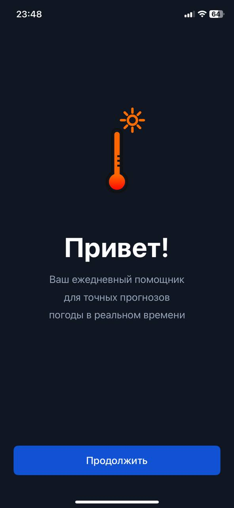
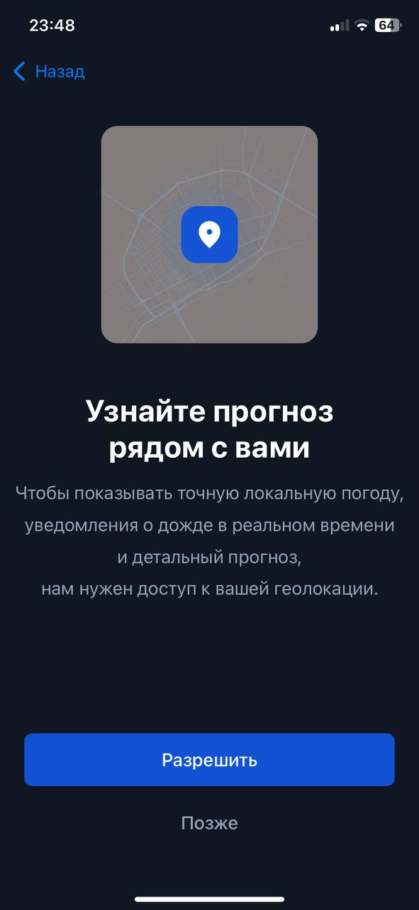
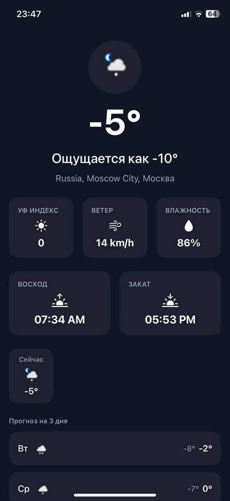
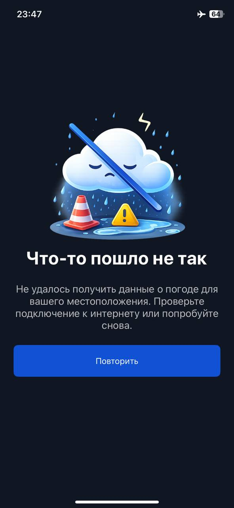

# 📱 Weather App 🌤️

Демонстрационное iOS-приложение, созданное с использованием **UIKit**, **Combine** и архитектуры **MVVM+C** с элементами **Clean Architecture**.  
Проект реализует модульную архитектуру и управляет навигацией через **Coordinator**, а также интеграцию с внешним **Weather API** для загрузки данных о погоде.

---

### 🔧 Технологический стек
- **UIKit** — построение интерфейса  
- **Combine** — реактивное управление состоянием  
- **MVVM+C** — архитектура для разделения логики и навигации  
- **Clean Architecture** — разделение слоёв приложения  
- **Kingfisher** — загрузка и кеширование изображений (подключён через Swift Package Manager)  
- **Lottie** — анимации (подключён через Swift Package Manager)  
- **Localization** — поддержка русского и английского языков интерфейса  

---

### 🧭 Основные функции
- **Текущая погода**  
  Отображение температуры, состояния погоды для текущего местоположения или города Москвы по умолчанию.  

- **Прогноз на несколько дней**  
  Подробный прогноз с температурой, ветром, влажностью, UV индексом.  

- **Дополнительная информация**  
  Включает ощущаемую температуру, скорость ветра, UV индекс и влажность.  

- **Геолокация**  
  Возможность автоматически определить местоположение пользователя и показать погоду для него.  

- **Локализация**  
  Поддержка двух языков интерфейса:  
  - 🇷🇺 Русский  
  - 🇬🇧 Английский  
  Язык интерфейса выбирается автоматически в зависимости от системных настроек устройства. 
  
  
 
        
        
        
        
  

  
---

### ✅ Особенности проекта
- Модульная архитектура с разделением слоёв.  
- Использование **Combine** для реактивной связи ViewModel и View.  
- Подключение сторонних библиотек через **Swift Package Manager**: Kingfisher для изображений, Lottie для анимаций.  
- Полная локализация интерфейса и системных сообщений.  
